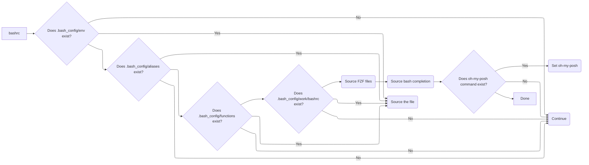

# My Dotfiles

Directory structure and setup is managed by simple tool [dothome](https://github.com/onurozuduru/dothome).

## Description of Files and Directories

|File/Directory|Description                                                                                                |
|--------------|-----------------------------------------------------------------------------------------------------------|
|.profile      | Adds following directories to `$PATH` if they exist: `$HOME/bin`, `$HOME/.local/bin`, `/usr/local/go/bin`.|
|.bashrc       | Sets prompt, includes files under `.bash_config` and `.bash_config/work` if they exist.                   |
|.bash_config/ | Stores files for `aliases`, `functions`, `env`.                                                           |
|.config/nvim/ | Neovim config based on [AstroNvim user template](https://github.com/AstroNvim/template).                  |

## Bash Configuration Logic

